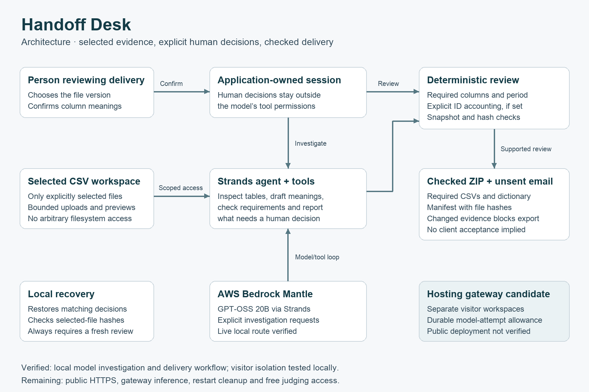
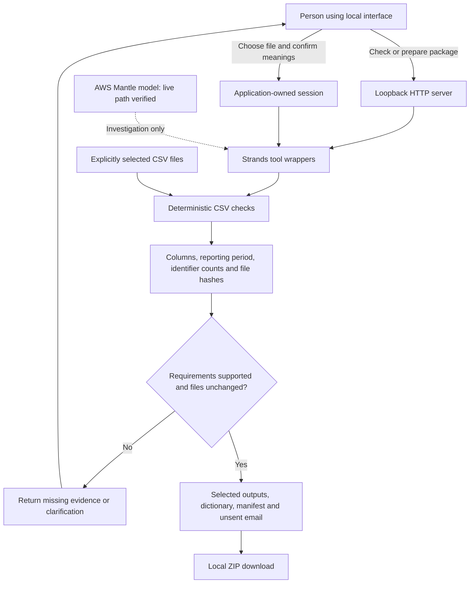

# Handoff Desk architecture

The current executable workflow supports original fictional CSVs and explicitly selected CSV projects. A person chooses
which version governs, confirms column meanings and requests a package. File
evidence can inform those choices, but it cannot authorize them.

## Components

| Component | Responsibility |
| --- | --- |
| `interface.html`, `interface.css`, `interface.js` | CSV intake, dynamic previews, human confirmations and clearly marked fictional demo |
| `server.py` | Single-user session with optional persistence, request validation, action routing and ZIP delivery |
| `hosted.py` | Separate WSGI gateway with private visitor sessions, per-visitor serialization, expiry and one concurrent investigation |
| `admission.py` | Durable aggregate model-attempt reservations across visitors, projects and restarts |
| `intake.py` | Bounded CSV project creation and selected-file metadata validation |
| `agent.py` | Strands tool definitions and system instructions; model cannot record human confirmations |
| `core.py` | Selected-file scope, CSV validation, exact identifier occurrence accounting, evidence snapshots and archive generation |
| `session_store.py` | Optional private local confirmation storage; recovery checks file hashes and checklist, then replays human decisions without restoring reviews |
| `live_agent.py` | Explicitly enabled Bedrock connection with model-call, output and input-estimate limits; live AWS Mantle invocation verified with fictional data |
| `demo.py` | Reproducible scripted fixture sequence, separate from any claim of live model reasoning |

## What the checks establish

Required columns and reporting periods are checked against an explicit checklist.
Identifier occurrence counts preserve `001` and `1` as different keys and preserve
duplicate multiplicity. A matching partition does not establish equality of all
row values or business correctness. Required column meanings originate in human
confirmation. Export rechecks file snapshots and refuses changed evidence.

The archive includes selected deliverables and accounting outputs, their hashes,
a confirmed dictionary and an email draft marked as unsent. Raw reference inputs
are excluded unless independently required. A successful archive is not proof of
customer acceptance, delivery, payment or earnings.

## Remaining deployment work

Live Strands investigation through AWS Mantle and the local HTTP route has been verified with fictional files. Deterministic checks and human confirmations remain separate from model investigation. Model-call limits persist across requests; each request starts a fresh deadline.
Optional local confirmation recovery is implemented; it is not a multi-user
database or protection against a malicious owner modifying their own files.
Cloud hosting must provide isolated per-user workspaces, hosted confirmation
storage, bounded inference, controlled uploads and free judging access. These are
deployment requirements, not properties proven by the local HTTP checks.

No private DeltaX engine implementation, customer files or credentials belong in
the public repository or demo recording.

The separate hosting gateway now implements visitor isolation and durable aggregate model-attempt admission. These passed offline tests and a local Gunicorn HTTP check. Public proxy/TLS, live gateway inference and crash-orphan cleanup remain deployment work; see HOSTING.md.
